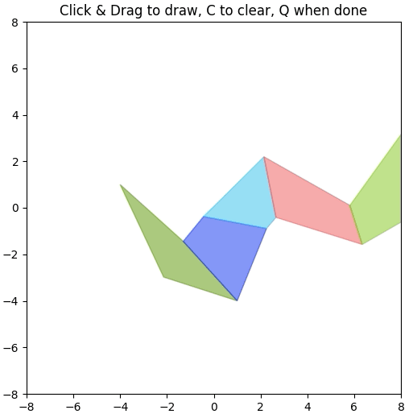
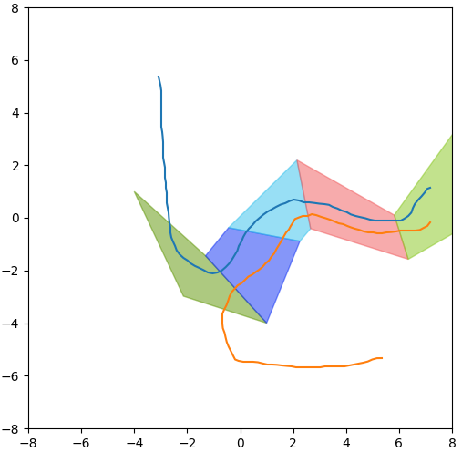

# Grounding Language Plans in Demonstrations (GLiDE)

Code for ICLR 2024 spotlight paper [Grounding Language Plans in Demonstrations through Counterfactual Perturbations](https://yanweiw.github.io/glide/)

## Configure Conda Environment 

```
conda env create -f environment.yml
conda activate glide

# (Optional) Add kernel for jupyter notebook 
python -m ipykernel install --user --name glide
```

## 2D Navigation Task
The navigation domain serves as a 2D abstraction of the modal structure for multi-step manipulation tasks, where each polygon represents a different mode with its boundary showing the constraint. Task success depends on starting in the free space (white) and traversing through the polygon sequence consecutively until reaching the final polygon. Invalid mode transitions, such as direct crossings from the white into colored polygons other than the first polygon entered by demonstrations, will cause execution failures.

### Generate Data
To generate a new task of a sequence of randomly sampled connected convex polygons, run
```
python draw_demo.py --out_dir data_gen/tmp --seed 5 --n_poly 5 
```
`n_poly` specifies how many polygons there are. Draw a couple demonstrations by clicking and dragging your mouse. 

Demonstration by drawing | A small dataset of successful trajectories
:----------------------------:|:-----------------------:
 | 

Augment the demonstrations with counterfactual perturbations
```
python augment_demo.py --dir data_gen/tmp --num 500
```
`num` specifies how many trajectories (both successful and unsuccessful after perturbations) to generate by perturbing the demonstration replays. 

### Train the Mode Classifier

To train with the generated data, run 
```
python train_classifier.py --dir data_gen/polygon_4 --n_mds 5
```
and visualize the learned modes on Wandb or locally at `weights/{wandb_run_name}`. `Wandb_run_name` is printed out upon running the training script. `n_mds` specifies the number of modes (number of polygons + the white region).

### Tutorial for Visualizing the Learned Grounding Classifer and Mode-Based Planning

Please refer to `tutorial.ipynb`
